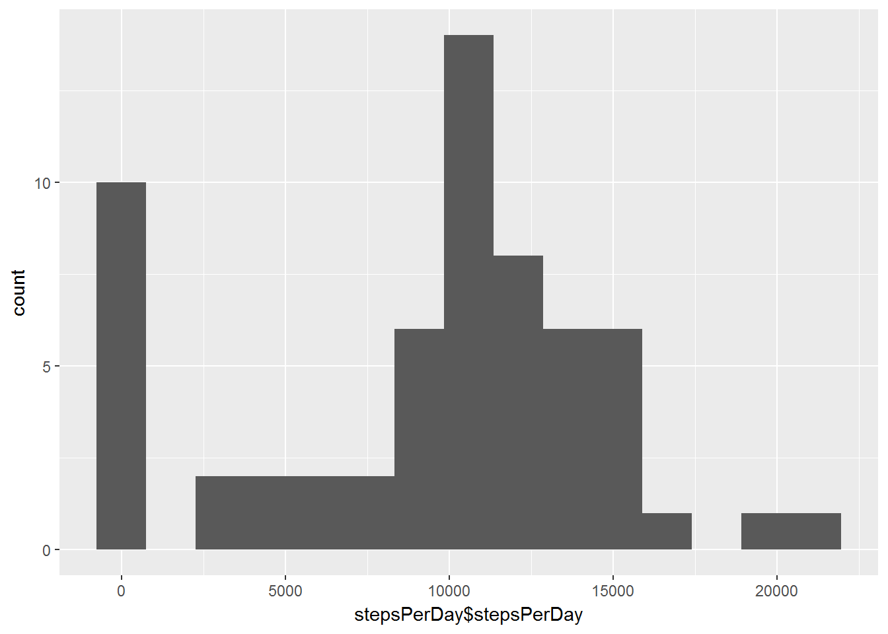

#### Libraries Used

    library(ggplot2)
    library(dplyr)

#### 1. Code for reading in dataset/processing data

    # Save file URL
    fileURL <- "https://d396qusza40orc.cloudfront.net/repdata%2Fdata%2Factivity.zip"

    # Download and extract data into working directory if it does not already exist
    if(!file.exists("proj1.zip")){
    download.file(fileURL, "./proj1.zip")
    unzip("./proj1.zip", exdir = "./proj1data")
    }

    # Read data into R
    activityData <- read.csv("./proj1data/activity.csv", header =T)

    # Convert date variable to correct format
    activityData$date <- as.Date(as.character(activityData$date, "%Y-%m-%d"))

#### 2. Histogram of the total number of steps taken each day

    # Group data by date(day), and then calculate steps per day - ignoring missing values.  
    # Store results in stepsPerDay data frame
    activDataGroup <- group_by(activityData, date)
    stepsPerDay <- summarize(activDataGroup, stepsPerDay = sum(steps, na.rm = T))
                                
    # Create histogram with 15 bins
    qplot(stepsPerDay$stepsPerDay, bins = 15)

#### 3. Mean Steps per day

    mean(stepsPerDay$stepsPerDay)

    ## [1] 9354.23

    median(stepsPerDay$stepsPerDay)

    ## [1] 10395

We note that the mean steps per day is 9354.23, and the median steps is
10395.

#### 4. Time Series plot of average number of steps taken

    # Group the data by interval
    byInterval <- group_by(activityData, interval)

    # Calculate the average steps per interval - ignoring missing values
    dailyActivity <- summarize(byInterval, meanSteps = mean(steps, na.rm = T))

    # Plot time series with ggplot 2, using the dailyActivity data
    qplot(interval, meanSteps, data = dailyActivity, geom ='line' )

#### 5. 5-minute Interval with maximum steps

    dailyActivity[which(dailyActivity$meanSteps == max(dailyActivity$meanSteps)),]

    ## # A tibble: 1 × 2
    ##   interval meanSteps
    ##      <int>     <dbl>
    ## 1      835  206.1698

We note that the interval with the maximum (on average) steps is 835,
with 206.2 steps

#### 6. Code to describe and show a strategy for imputing missing values

    sum(is.na(activityData$steps))

    ## [1] 2304

We note that there are 2304 missing values in the data set. My strategy
to impute missing values is to replace "NA" values with the average
steps for that interval

    # create new data set with imputed values to preserve original data set
    activeDataImputed <- activityData

    # Replace missing values with interval average for that period using matrix operations
    activeDataImputed$steps[is.na(activeDataImputed$steps)] <- 
        dailyActivity$meanSteps[match(activeDataImputed$interval,dailyActivity$interval)]

    sum(is.na(activeDataImputed$steps))

    ## [1] 0

We see that the imputation process has removed all missing values.

#### 7. Histogram of steps per day with imputed values

    imputedGrouped <- group_by(activeDataImputed, date)

    imputedStepPerDay <- summarize(imputedGrouped, steps_per_day = sum(steps))

    # Make histogram with 15 bins as in orginal plot
    qplot(imputedStepPerDay$steps_per_day, bins = 15)

We see that the number of days with 0 steps has decreased drastically

##### Mean and Median imputed steps

    mean(imputedStepPerDay$steps_per_day)

    ## [1] 10766.19

    median(imputedStepPerDay$steps_per_day)

    ## [1] 10766.19

Interestingly, the mean and median steps values are exactly equal to one
another with 10766.19 steps

#### 8. Panel plot - Average \# of steps Weekday vs. Weekend

    # Create new data frame with imputed data to preserve orginal data
    patternData <- activeDataImputed

    # create new variable "daynames" using weekdays function, which assigns the day to each interval
    patternData$daynames <- weekdays(patternData$date)

    # Create charactor vector with weekend names 
    weekends <- c("Saturday", "Sunday")

    # Create indicator for weekend and weekday variable types
    patternData <- mutate(patternData, 
                          dayType = ifelse(daynames %in% weekends, 
                                           "weekend", "weekday" ))

    # Group the data by dayType and interval, and calculate the average steps by 
    # day type and interval
    patternGrouped <- group_by(patternData, dayType, interval)
    patternSummarized <- summarize(patternGrouped, meanSteps = mean(steps))

#### Plot

    # create ggplot object using the summarized data
    gg <- ggplot(data = patternSummarized, aes(x = interval, y = meanSteps, color = dayType))

    # add facets for weekend and weeday and the lines for each to the gg object
    gg <- gg + facet_grid(dayType~.) + geom_line()

    # Print object
    gg

